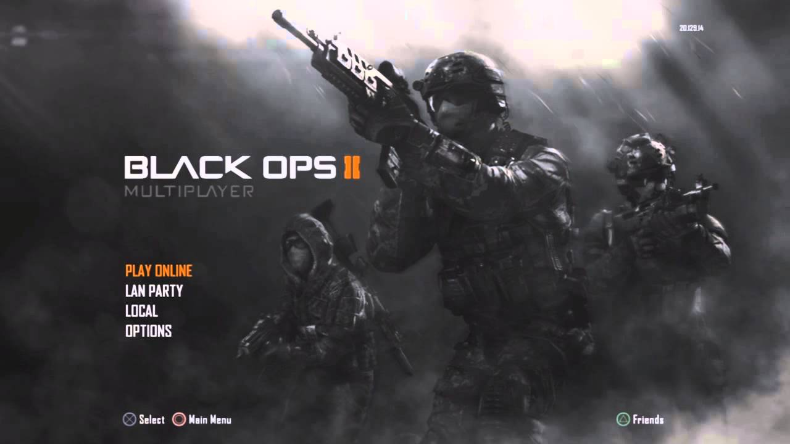

	<!DOCTYPE HTML>
<html lang="en">
<head>
	<title>Call of Duty: Black Ops II</title>
	<meta name="viewport" content="width=device-width, initial-scale=1.0"/>
	<meta name="description" content="this website explains why you should buy Call of Duty: Black Ops II"/>
	<link rel="stylesheet" type="text/css" href="main.css"/>
	<meta charset="utf-8"/>
</head>
<body>
<h1>Black Ops 2 Multiplayer</h1>

 
<h2>Multiplayer Synopsis</h2>
	
One of the biggest changes added to multiplayer mode in Black Ops II is the introduction of Pick 10, a new system within the Create-a-Class menu. Pick 10 gives the player a total of 10 allocation slots in a class, which are 	used for guns, perks, and grenades. The player can customize the slot allocation, to either have more attachments for a gun, or more perks.

	
Killstreaks from previous Call of Duty games are renamed as Scorestreaks, which are now earned by gaining points, rather than kills. This allows the player to focus on objective modes, which also earn points towards 	Scorestreaks.

	
Unlike past games, weapons in Black Ops II have a progression system, which is used to unlock weapon attachments. After maxing out a weapon's level, the player can choose to "prestige" the gun, similar to how they can prestige 	the player level, and reset their attachment progress. In exchange, the player can customize their weapons with custom clan tags and emblems.

	
Black Ops II is also the first Call of Duty game to include a competitive mode. Known as League Play, the mode allows players of similar skill level to be matched together, and play according to the rules of Major League 	Gaming.

<a href="Campaign.html" target="_blank" title="Campaign Page">Campaign Page</a>
<a href="Zombies.html" target="_blank" title="Zombies Page">Zombies Page</a>
</body>
